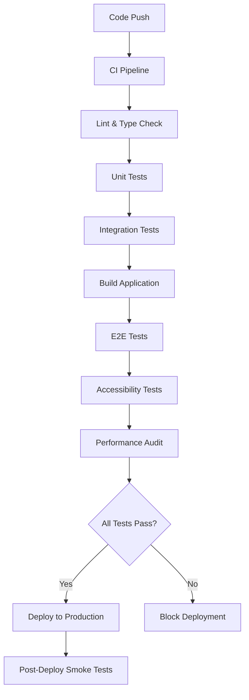

# CI/CD Pipeline & Deployment Architecture

## Overview

Automated CI/CD pipeline using GitHub Actions with quality gates, performance monitoring, and zero-downtime deployment to Netlify.

## Pipeline Architecture



## GitHub Actions Workflows

### 1. Continuous Integration (.github/workflows/ci.yml)

```yaml
name: CI Pipeline

on:
  push:
    branches: [main, develop]
  pull_request:
    branches: [main]

jobs:
  test:
    runs-on: ubuntu-latest
    strategy:
      matrix:
        node-version: [18, 20]
    steps:
      - uses: actions/checkout@v4

      - name: Setup Node.js ${{ matrix.node-version }}
        uses: actions/setup-node@v4
        with:
          node-version: ${{ matrix.node-version }}
          cache: 'npm'

      - name: Install dependencies
        run: npm ci

      - name: Lint code
        run: npm run lint

      - name: Type check
        run: npm run type-check

      - name: Run unit tests
        run: npm run test:unit -- --coverage

      - name: Run integration tests
        run: npm run test:integration

      - name: Build application
        run: npm run build

      - name: Upload coverage to Codecov
        uses: codecov/codecov-action@v3
        with:
          file: ./coverage/coverage-final.json

  e2e:
    runs-on: ubuntu-latest
    needs: test
    steps:
      - uses: actions/checkout@v4

      - name: Setup Node.js
        uses: actions/setup-node@v4
        with:
          node-version: '20'
          cache: 'npm'

      - name: Install dependencies
        run: npm ci

      - name: Build application
        run: npm run build

      - name: Start application
        run: npm run preview &

      - name: Wait for server
        run: npx wait-on http://localhost:4173

      - name: Run E2E tests
        run: npm run test:e2e

      - name: Upload E2E artifacts
        uses: actions/upload-artifact@v3
        if: failure()
        with:
          name: cypress-screenshots
          path: cypress/screenshots

  accessibility:
    runs-on: ubuntu-latest
    needs: test
    steps:
      - uses: actions/checkout@v4

      - name: Setup Node.js
        uses: actions/setup-node@v4
        with:
          node-version: '20'
          cache: 'npm'

      - name: Install dependencies
        run: npm ci

      - name: Build application
        run: npm run build

      - name: Start application
        run: npm run preview &

      - name: Wait for server
        run: npx wait-on http://localhost:4173

      - name: Run accessibility audit
        run: npm run test:a11y

      - name: Upload accessibility report
        uses: actions/upload-artifact@v3
        with:
          name: accessibility-report
          path: accessibility-report.html
```

### 2. Production Deployment (.github/workflows/deploy.yml)

```yaml
name: Deploy to Production

on:
  push:
    branches: [main]
  workflow_run:
    workflows: ['CI Pipeline']
    types:
      - completed
    branches: [main]

jobs:
  deploy:
    runs-on: ubuntu-latest
    if: ${{ github.event.workflow_run.conclusion == 'success' }}

    steps:
      - uses: actions/checkout@v4

      - name: Setup Node.js
        uses: actions/setup-node@v4
        with:
          node-version: '20'
          cache: 'npm'

      - name: Install dependencies
        run: npm ci

      - name: Build for production
        run: npm run build
        env:
          NODE_ENV: production

      - name: Run pre-deployment tests
        run: npm run test:build

      - name: Deploy to Netlify
        uses: nwtgck/actions-netlify@v2
        with:
          publish-dir: './dist'
          production-branch: main
          github-token: ${{ secrets.GITHUB_TOKEN }}
          deploy-message: 'Deploy from GitHub Actions'
          enable-commit-comment: false
        env:
          NETLIFY_AUTH_TOKEN: ${{ secrets.NETLIFY_AUTH_TOKEN }}
          NETLIFY_SITE_ID: ${{ secrets.NETLIFY_SITE_ID }}

      - name: Run post-deployment smoke tests
        run: npm run test:smoke -- --baseUrl=${{ steps.netlify.outputs.deploy-url }}
```

### 3. Performance Monitoring (.github/workflows/lighthouse.yml)

```yaml
name: Lighthouse Performance Audit

on:
  push:
    branches: [main]
  schedule:
    - cron: '0 6 * * 1' # Weekly on Mondays

jobs:
  lighthouse:
    runs-on: ubuntu-latest
    steps:
      - uses: actions/checkout@v4

      - name: Setup Node.js
        uses: actions/setup-node@v4
        with:
          node-version: '20'
          cache: 'npm'

      - name: Install dependencies
        run: npm ci

      - name: Build application
        run: npm run build

      - name: Start application
        run: npm run preview &

      - name: Wait for server
        run: npx wait-on http://localhost:4173

      - name: Run Lighthouse CI
        run: |
          npm install -g @lhci/cli@0.12.x
          lhci autorun
        env:
          LHCI_GITHUB_APP_TOKEN: ${{ secrets.LHCI_GITHUB_APP_TOKEN }}

      - name: Upload Lighthouse report
        uses: actions/upload-artifact@v3
        with:
          name: lighthouse-report
          path: '.lighthouseci'
```

## Performance Budget & Monitoring

### Lighthouse Configuration

```javascript
// lighthouse.config.js - Performance budgets
module.exports = {
  ci: {
    collect: {
      url: [
        'http://localhost:4173/',
        'http://localhost:4173/visualize/scatter',
      ],
      startServerCommand: 'npm run preview',
      numberOfRuns: 3,
    },
    assert: {
      // Performance budgets based on PRD requirements
      assertions: {
        'categories:performance': ['error', { minScore: 0.9 }],
        'categories:accessibility': ['error', { minScore: 1.0 }],
        'categories:best-practices': ['error', { minScore: 0.9 }],
        'categories:seo': ['error', { minScore: 0.9 }],

        // Specific metrics
        'first-contentful-paint': ['error', { maxNumericValue: 2000 }], // < 2s
        'largest-contentful-paint': ['error', { maxNumericValue: 2500 }],
        'cumulative-layout-shift': ['error', { maxNumericValue: 0.1 }],
        'total-blocking-time': ['error', { maxNumericValue: 300 }], // < 300ms

        // Bundle size constraints
        'resource-summary:document:size': ['error', { maxNumericValue: 50000 }],
        'resource-summary:script:size': ['error', { maxNumericValue: 512000 }], // < 500KB
        'resource-summary:stylesheet:size': [
          'error',
          { maxNumericValue: 25000 },
        ],
      },
    },
    upload: {
      target: 'temporary-public-storage',
    },
  },
};
```

### Bundle Analysis Integration

```typescript
// vite.config.ts - Bundle analysis integration
export default defineConfig({
  plugins: [
    react(),
    // Bundle analyzer for monitoring bundle size
    process.env.ANALYZE && bundleAnalyzer(),
  ],
  build: {
    // Enable source maps for production debugging
    sourcemap: true,
    // Rollup options for optimal bundling
    rollupOptions: {
      output: {
        manualChunks: {
          vendor: ['react', 'react-dom', 'react-router-dom'],
          state: ['zustand'],
          ui: ['@strudel-ui/react'],
          charts: ['d3-scale', 'd3-selection', 'd3-axis'],
          export: ['html2canvas', 'file-saver'],
        },
      },
    },
  },
});
```

## Quality Gates

### Required Checks for Deployment

1. **Linting**: ESLint with zero errors
2. **Type Checking**: TypeScript compilation success
3. **Unit Tests**: 80% coverage across all metrics
4. **Integration Tests**: All component interactions pass
5. **E2E Tests**: Complete user workflows verified
6. **Accessibility**: WCAG 2.1 AA compliance (100%)
7. **Performance**: Lighthouse scores meet budget requirements
8. **Bundle Size**: Under 500KB gzipped

### Branch Protection Rules

- **Require pull request reviews**: 1 reviewer minimum
- **Require status checks**: All CI jobs must pass
- **Require up-to-date branches**: Force branch updates before merge
- **Include administrators**: Apply rules to admin users
- **Restrict pushes**: Only allow squash and merge

## Deployment Strategy

### Static Site Deployment

- **Host**: Netlify with global CDN
- **Deploy trigger**: Successful CI pipeline on main branch
- **Build command**: `npm run build`
- **Publish directory**: `dist/`
- **Environment variables**: Managed via Netlify dashboard

### Preview Deployments

- **Pull Request Previews**: Auto-generated for every PR
- **Branch Deployments**: Feature branches deploy to staging URLs
- **Deploy Previews**: Shareable URLs for stakeholder review

### Rollback Strategy

- **Instant Rollback**: Netlify provides one-click rollback
- **Atomic Deployments**: New version only goes live when fully deployed
- **Blue-Green Deployment**: Zero downtime during updates

## Environment Configuration

### Development

```bash
NODE_ENV=development
VITE_API_BASE_URL=http://localhost:5173
VITE_ENABLE_DEBUG=true
```

### Production

```bash
NODE_ENV=production
VITE_API_BASE_URL=https://penguins-explorer.netlify.app
VITE_ENABLE_ANALYTICS=true
```

### Secrets Management

Sensitive values stored in GitHub Secrets:

- `NETLIFY_AUTH_TOKEN` - Netlify deployment authentication
- `NETLIFY_SITE_ID` - Target site identifier
- `LHCI_GITHUB_APP_TOKEN` - Lighthouse CI GitHub integration
- `CODECOV_TOKEN` - Code coverage reporting

## Monitoring & Alerts

### Performance Monitoring

- **Lighthouse CI**: Weekly performance audits
- **Bundle Analysis**: Automated size regression detection
- **Core Web Vitals**: Real user monitoring via analytics

### Error Tracking

- **Build Failures**: GitHub notifications to team
- **Test Failures**: Detailed reports with screenshots
- **Deployment Issues**: Immediate Slack notifications

### Health Checks

- **Uptime Monitoring**: External service pings
- **Performance Alerts**: Threshold-based notifications
- **Error Rate Monitoring**: Automatic issue creation
